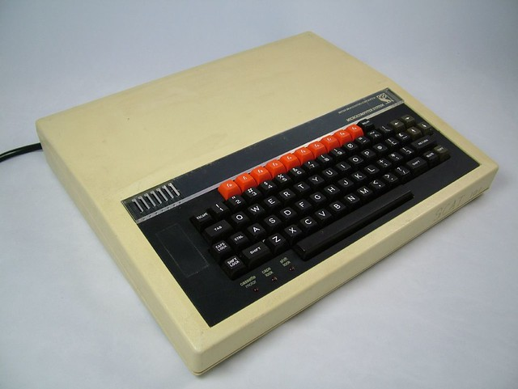

```cpp
ChrisEdsall.get_info<sycl::info::speaker>()
```


:::::::::::::: {.columns}
::: {.column width="25%"}


:::


::: {.column width="25%"}


:::

::: {.column width="25%"}


:::

::: {.column width="25%"}


:::

::::::::::::::

::: notes

- First computer BBC Model B - BBC BASIC
- Cray T3E
- More systems at NOC, Bristol (Isambard) and Cambridge
- Earth Science

:::

---

## LUMI / LEONARDO

:::::::::::::: {.columns}
::: {.column width="50%"}


- CPU: AMD
- GPU: AMD

:::
::: {.column width="50%"}


- CPU: Intel
- GPU: Nvidia

:::
::::::::::::::

::: notes

:::
---


## Aurora / Frontier / Perlmutter


::: notes

:::

---

## What programming model to use?

::: notes

:::

---

## SYCL

{ width=50% }

- royalty-free, cross-platform abstraction layer that:
- Enables code for heterogeneous and offload processors to be written using modern ISO C++ (at least C++ 17).
- Provides APIs and abstractions to find devices (e.g. CPUs, GPUs, FPGAs) on which code can be executed, and to manage data resources and code execution on those devices.

::: notes

:::

---


---


---

## Hello World

```cpp
#include <iostream>
#include <CL/sycl.hpp>

class vector_addition;

int main(int, char**) {
   cl::sycl::float4 a = { 1.0, 2.0, 3.0, 4.0 };
   cl::sycl::float4 b = { 4.0, 3.0, 2.0, 1.0 };
   cl::sycl::float4 c = { 0.0, 0.0, 0.0, 0.0 };

   cl::sycl::default_selector device_selector;

   cl::sycl::queue queue(device_selector);
   std::cout << "Running on "
             << queue.get_device().get_info<cl::sycl::info::device::name>()
             << "\n";
   {
      cl::sycl::buffer<cl::sycl::float4, 1> a_sycl(&a, cl::sycl::range<1>(1));
      cl::sycl::buffer<cl::sycl::float4, 1> b_sycl(&b, cl::sycl::range<1>(1));
      cl::sycl::buffer<cl::sycl::float4, 1> c_sycl(&c, cl::sycl::range<1>(1));
  
      queue.submit([&] (cl::sycl::handler& cgh) {
         auto a_acc = a_sycl.get_access<cl::sycl::access::mode::read>(cgh);
         auto b_acc = b_sycl.get_access<cl::sycl::access::mode::read>(cgh);
         auto c_acc = c_sycl.get_access<cl::sycl::access::mode::discard_write>(cgh);

         cgh.single_task<class vector_addition>([=] () {
         c_acc[0] = a_acc[0] + b_acc[0];
         });
      });
   }
   std::cout << "  A { " << a.x() << ", " << a.y() << ", " << a.z() << ", " << a.w() << " }\n"
        << "+ B { " << b.x() << ", " << b.y() << ", " << b.z() << ", " << b.w() << " }\n"
        << "------------------\n"
        << "= C { " << c.x() << ", " << c.y() << ", " << c.z() << ", " << c.w() << " }"
        << std::endl;
		
   return 0;
}
```

---

## SYCLomatic

- Open Source
- (Previously Intel ``dpct``)
- Source to source translation
- migrates "90% - 95%" automatically
- comments in the source for lines the tool can't translate

---

## Performance

{ width=50% }

--- 

## Apps using SYCL


--- 

## Conferences


{ width=50% }

--- 

## EasyBuild 


--- 

## EasyBuild


---

## Image Credits

- BBC Model B: Steve Berry, Flickr, CC BY-NC-SA 2.0
- T3E: Marcin Wichary Wikipedia (CC BY 2.0)
- Lumi: By Pekka Agarth - Original publication: Official website of the LUMI consortiumImmediate source: https://www.lumi-supercomputer.eu/media/, Fair use, https://en.wikipedia.org/w/index.php?curid=71507871
- Leonardo: By E.saluzzi - Own work, CC BY-SA 4.0, https://commons.wikimedia.org/w/index.php?curid=125924357
- DOE Roadmap: Dubney et. al. https://doi.ieeecomputersociety.org/10.1109/MCSE.2021.3098231


---

## Thank You

- https://www.khronos.org/sycl/
- https://sycl.tech/
- https://github.com/codeplaysoftware/syclacademy
- https://www.zettascale.hpc.cam.ac.uk/
- @hpcchris@scholar.social
